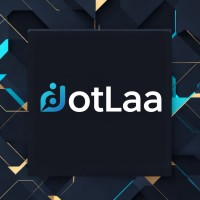
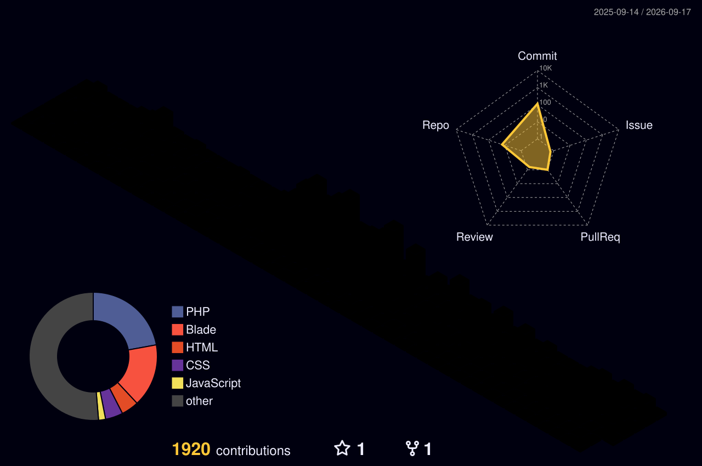

<div align="center">
  
</div>

<div align="center">
  <a href="mailto:01ahmedfawzy23@gmail.com"></a>
  <a href="https://linkedin.com/in/ahmedfawzy23"></a>
  <a href="https://github.com/ahmedfawzy23"></a>
  <a href="tel:+201274106118"></a>
</div>

<div align="center">
  
  
</div>

<br/>

<div align="center">
  
</div>

<br/>


##  &nbsp;About Me

<table>
<tr>
<td width="55%">

```php
<?php

namespace App\Developers;

class AhmedFawzy extends MidLevelDeveloper
{
    protected string $role = 'Mid-Level Backend Developer';
    protected string $location = 'Giza, Egypt';
    protected string $experience = '3+ years';
    protected string $education = 'Medical Informatics - Benha University';

    public function skills(): array
    {
        return [
            'backend'    => ['PHP', 'Laravel', 'REST APIs'],
            'databases'  => ['MySQL', 'SQL Server', 'Oracle', 'MongoDB'],
            'cms'        => ['WordPress', 'WooCommerce'],
            'frontend'   => ['Blade', 'JS', 'Bootstrap', 'Tailwind'],
            'devops'     => ['Docker', 'Git', 'CI/CD', 'Linux'],
        ];
    }

    public function achievements(): array
    {
        return [
            'mentored'  => '500+ developers',
            'projects'  => '10+ production systems',
            'response'  => '-30% avg response time',
            'debt'      => '-40% technical debt',
        ];
    }

    public function motto(): string
    {
        return 'Code like an artisan,
                architect like a visionary.';
    }
}
```

</td>
<td width="45%" align="center">


</td>
</tr>
</table>

---

## 🧑‍💼 &nbsp;Experience

<div align="center">
<table>
<tr>
<td align="center" width="50%">

<br/>
<b>Digital Bond</b><br/><br/>
<br/>
<sub><b>Sep 2025 – Present · Dokki, Egypt</b></sub><br/><br/>
<sub>✅ Built & optimized 10+ back-end systems & RESTful APIs</sub><br/>
<sub>✅ Reduced avg response time by 30% via caching & query optimization</sub><br/>
<sub>✅ Ensured seamless front-end integration & system reliability</sub>

</td>
<td align="center" width="50%">

<br/>
<b>Route Academy</b><br/><br/>
<br/>
<sub><b>Feb 2023 – Present · Dokki, Egypt (Hybrid)</b></sub><br/><br/>
<sub>✅ Mentored 500+ trainees — 90%+ satisfaction score</sub><br/>
<sub>✅ Led team of 3+ mentors across all cohorts</sub><br/>
<sub>✅ Coordinated curriculum delivery & training quality</sub>

</td>
</tr>
<tr>
<td align="center" width="50%">

<br/>
<b>Dotlaa Solution</b><br/><br/>
<br/><br/>
<sub>✅ Led backend architecture for 5+ client projects</sub><br/>
<sub>✅ Managed teams of 3–6 developers</sub><br/>
<sub>✅ Reduced technical debt by 40% via code reviews & best practices</sub>

</td>
<td align="center" width="50%">

<br/>
<b>Elevate Tech</b><br/><br/>
<br/><br/>
<sub>✅ Delivered high-performance backend solutions for diverse clients</sub><br/>
<sub>✅ Translated business requirements into robust architectures</sub><br/>
<sub>✅ Tailored solutions per project needs</sub>

</td>
</tr>
</table>
</div>

---

## 🎓 &nbsp;Education

<div align="center">
<table>
<tr>
<td align="center" width="50%">

🏛️<br/>
<b>Faculty of Computers & Artificial Intelligence</b><br/>
<sub>Benha University</sub><br/><br/>
<br/>
<sub><b>2019 – 2023 · Benha, Egypt</b></sub>

</td>
<td align="center" width="50%">

<br/>
<b>Route Academy</b><br/><br/>
<br/>
<sub><b>Aug 2022 – Jan 2023</b></sub>

</td>
</tr>
</table>
</div>

---

## 🧰 &nbsp;Tech Arsenal

<div align="center">

### ⚙️ Languages


### 🚀 Frameworks & CMS


### 🗄️ Databases

<br/>


### 🛠️ DevOps & Tools


</div>

---

## 🏗️ &nbsp;Projects

<div align="center">
<table>

<tr>
<td align="center" width="50%">
<br/><br/>
<sub><b>Nationwide Healthcare IPC Audits</b></sub><br/><br/>
<sub>Architected a dynamic survey engine with complex conditional</sub><br/>
<sub>logic & automated scoring for Infection Prevention & Control audits.</sub><br/>
<sub>Engineered hierarchical RBAC across National, Regional &</sub><br/>
<sub>Facility levels. Real-time FCM alerts & auto Action Plans.</sub><br/><br/>


</td>
<td align="center" width="50%">
<br/><br/>
<sub><b>Open Source Laravel Package</b></sub><br/><br/>
<sub>A powerful, flexible roles & permissions package for</sub><br/>
<sub>Laravel apps with built-in API support.</sub><br/>
<sub>Published on Packagist & available on GitHub.</sub><br/><br/>
<a href="https://packagist.org/packages/fawzy/laravel-roles-permissions"></a>
<a href="https://github.com/ahmedfawzy23/laravel-roles-permissions"></a>

</td>
</tr>

<tr>
<td align="center" width="50%">
<br/><br/>
<sub><b>Mobile Food-Ordering & Delivery</b></sub><br/><br/>
<sub>Built the complete backend for a mobile food-ordering</sub><br/>
<sub>& delivery app. Implemented loyalty points, vouchers</sub><br/>
<sub>& promo code modules to boost user retention.</sub><br/><br/>


</td>
<td align="center" width="50%">
<br/><br/>
<sub><b>Import/Export Trading Platform</b></sub><br/><br/>
<sub>Developed RESTful APIs & dynamic backend for an</sub><br/>
<sub>import/export platform with full CRUD for sectors,</sub><br/>
<sub>products, media, blogs & partners. Bilingual (AR/EN).</sub><br/><br/>


</td>
</tr>

</table>
</div>

<details>
<summary><b>View More Projects</b></summary>
<br/>
<div align="center">
<table>

<tr>
<td align="center" width="50%">
<br/><br/>
<sub><b>Student Management Platform</b></sub><br/><br/>
<sub>Bilingual platform connecting international students</sub><br/>
<sub>with Egyptian universities. Advanced search by country,</sub><br/>
<sub>university & specialization. End-to-end student journey</sub><br/>
<sub>from enrollment through graduation.</sub><br/><br/>


</td>
<td align="center" width="50%">
<br/><br/>
<sub><b>Bilingual Admission Platform</b></sub><br/><br/>
<sub>Developed a bilingual admission platform with advanced</sub><br/>
<sub>search & automated student application workflows.</sub><br/>
<sub>Built a dynamic CMS for university programs & services.</sub><br/><br/>


</td>
</tr>

<tr>
<td align="center" width="50%">
<br/><br/>
<sub><b>Real Estate Platform</b></sub><br/><br/>
<sub>Built & optimized the backend using WordPress (PHP)</sub><br/>
<sub>with custom listings, filters & multi-language support.</sub><br/><br/>


</td>
<td align="center" width="50%">
<br/><br/>
<sub><b>Online Course Booking System</b></sub><br/><br/>
<sub>Complete booking system with secure auth, course</sub><br/>
<sub>browsing & booking. Admin dashboard for course</sub><br/>
<sub>management with Laravel MVC, migrations & Blade.</sub><br/><br/>


</td>
</tr>

<tr>
<td align="center" colspan="2">
<br/><br/>
<sub><b>AI-Powered Early Detection of Pulmonary Diseases</b></sub><br/><br/>
<sub>Developed an AI-powered system for early detection of pulmonary diseases through respiratory sounds analysis.</sub><br/>
<sub>Full-stack: HTML5, CSS3, JavaScript, Bootstrap, jQuery, PHP, Laravel, MySQL & Python.</sub><br/><br/>


</td>
</tr>

</table>
</div>
</details>

<br/>


## 📊 &nbsp;GitHub Analytics

<div align="center">
  
</div>

<br/>

<div align="center">
  
</div>

---

## 🐍 &nbsp;Contribution Snake

<div align="center">
  <picture>
    <source media="(prefers-color-scheme: dark)" srcset="https://raw.githubusercontent.com/ahmedfawzy23/ahmedfawzy23/output/github-snake-dark.svg" />
    <source media="(prefers-color-scheme: light)" srcset="https://raw.githubusercontent.com/ahmedfawzy23/ahmedfawzy23/output/github-snake.svg" />
    
  </picture>
</div>

---

## 🧊 &nbsp;3D Contribution Map

<div align="center">
  
</div>

<br/>


<div align="center">

```
php artisan inspire
// "Simplicity is the ultimate sophistication." — Leonardo da Vinci
```

</div>

<div align="center">
  
</div>
