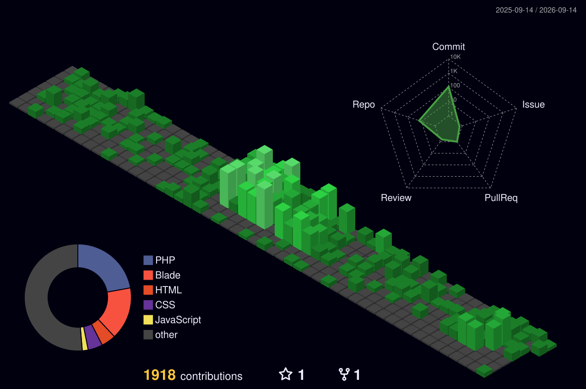

  

  

  

---

### ♟️ The Grandmaster's Challenge (Play Chess with Me!)

  
Can you beat the Architect? Click on a piece to move!

  
<!-- CHESS-BOARD:START -->
<!-- CHESS-BOARD:END -->

   

  <table>
    <tr>
      <td width="50%">
        <strong>Latest Moves:</strong> 
        <!-- CHESS-LAST-MOVES:START -->
        <!-- CHESS-LAST-MOVES:END -->
      </td>
      <td width="50%">
        <strong>Tournament Stats:</strong> 
        <!-- CHESS-STATS:START -->
        <!-- CHESS-STATS:END -->
      </td>
    </tr>
  </table>
  
  
<i>To start a new game, just open an issue with the title "Chess: Start new game"</i>

---

### 🏛️ Digital Architect's Manifesto (About Me)

| 🇸🇦 بالعربية | 🇬🇧 In English |
| :--- | :--- |
| **أنا أحمد فوزي**، مطور أنظمة خلفية شغوف ببناء حلول برمجية متينة وقابلة للتوسع. أؤمن أن الكود ليس مجرد أوامر، بل هو "عمارة رقمية" تتطلب الدقة والإتقان. | **I am Ahmed Fawzy**, a Backend Architect dedicated to building robust and scalable digital ecosystems. I view code as "Digital Architecture" that requires precision and craftsmanship. |
| **معلم برمجيات**: أساعد المبدعين الطموحين في إتقان قواعد البيانات ومنطق الأنظمة. | **Backend Mentor**: Assisting aspiring developers in mastering SQL, API design, and System Logic. |
| **علاقة وطيدة بالفن**: متيم بفن العمارة الإسلامية ودقة الشعر الجاهلي والعباسي. | **Art & Culture**: Passionate about Islamic Architecture and the intricate rhythms of Classical Arabic Poetry. |

---

### 🛠️ The Tech Zellige (Skills)

  <table>
    <tr>
      <td align="center"><strong>Foundation (Core)</strong></td>
      <td align="center"><strong>Structure (Frameworks)</strong></td>
      <td align="center"><strong>Veneer (Frontend)</strong></td>
    </tr>
    <tr>
      <td>
        
        
        
      </td>
      <td>
        
        
        
      </td>
      <td>
        
        
      </td>
    </tr>
  </table>

---

### 📊 The Blueprint of Activity (Stats)

  

 

  
  

  

  

---

### 🔗 Connect via Infrastructure

  
  
  

 

  

