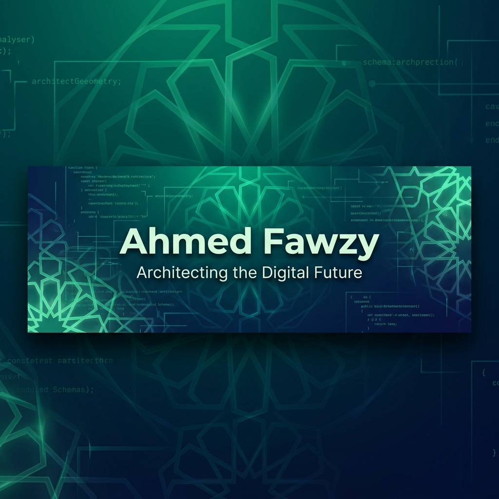
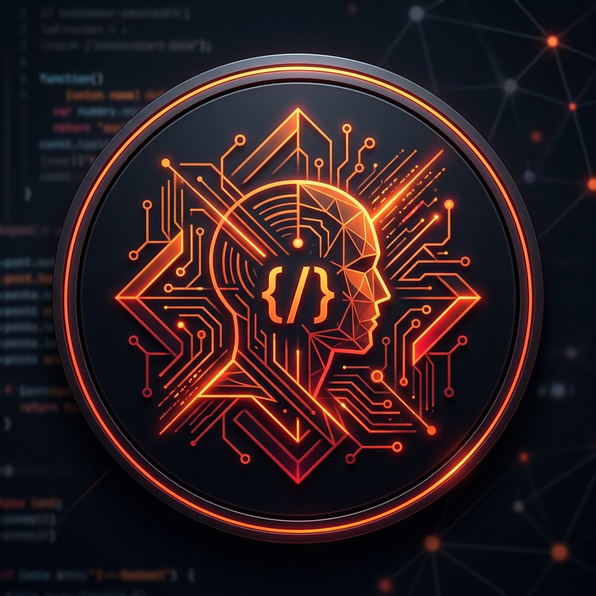

<div align="center">
  
</div>

<br/>

<div align="center">
  
</div>

<br/>

<table width="100%" border="0" cellspacing="0" cellpadding="0">
  <tr>
    <td width="62%" valign="top">
      <h3>Welcome to my GitHub workspace!</h3>
      <p>
        I'm a detail-oriented Backend Engineer specialized in building robust, high-performance web backends,
        secure RESTful APIs, and custom package structures using <strong>Laravel & PHP</strong>.
        Currently at <strong>Digital Bond</strong>, I architect production-grade systems and lead engineering practices.
      </p>

      <table>
        <tr>
          <td><b>Email</b></td>
          <td><a href="mailto:01ahmedfawzy23@gmail.com">01ahmedfawzy23@gmail.com</a></td>
        </tr>
        <tr>
          <td><b>LinkedIn</b></td>
          <td><a href="https://linkedin.com/in/ahmedfawzy23">linkedin.com/in/ahmedfawzy23</a></td>
        </tr>
        <tr>
          <td><b>WhatsApp</b></td>
          <td><a href="https://wa.me/201274106118">+20 127 410 6118</a></td>
        </tr>
        <tr>
          <td><b>Location</b></td>
          <td>Giza, Egypt — Open to Remote & Hybrid roles</td>
        </tr>
        <tr>
          <td><b>Resume</b></td>
          <td><a href="https://bit.ly/Ahmed_Fawzy_PHP_Laravel_Developer" target="_blank"><b>Download PDF CV</b></a></td>
        </tr>
      </table>

      <br/>
      <b>Status:</b> Open to Backend / Laravel roles (Egypt or Remote)
    </td>
    <td width="38%" align="center" valign="middle">
      <div style="border: 2px solid #00e6a2; border-radius: 16px; padding: 16px; background-color: #0D1117; display: inline-block; box-shadow: 0 4px 24px rgba(0,230,162,0.18);">
        <h4 style="margin-top: 0; color: #00e6a2; font-family: monospace;">Scan or Click for CV</h4>
        <a href="https://bit.ly/Ahmed_Fawzy_PHP_Laravel_Developer" target="_blank">
          
        </a>
        <br/>
        <a href="https://bit.ly/Ahmed_Fawzy_PHP_Laravel_Developer" target="_blank"><b>bit.ly/Ahmed_Fawzy_CV</b></a>
      </div>
    </td>
  </tr>
</table>

<br/>


<br/>

## About Me

<table width="100%">
<tr>
<td width="55%" valign="top">

```php
<?php

namespace App\Developers;

class AhmedFawzy extends BackendDeveloper
{
    protected string $role       = 'Backend Engineer';
    protected string $location   = 'Giza, Egypt';
    protected string $experience = '2+ years';
    protected string $education  = 'Medical Informatics';

    public function skills(): array
    {
        return [
            'backend'   => ['PHP', 'Laravel', 'REST APIs'],
            'databases' => ['MySQL', 'SQL Server', 'MongoDB'],
            'cms'       => ['WordPress', 'WooCommerce'],
            'frontend'  => ['Blade', 'JS', 'Bootstrap'],
            'devops'    => ['Docker', 'Git', 'Linux'],
        ];
    }

    public function achievements(): array
    {
        return [
            'response' => '-30% avg response time via caching',
            'bugs'     => '-25% regression bugs via PR reviews',
            'mentored' => '500+ developers trained',
            'projects' => '10+ production systems shipped',
        ];
    }
}
```

</td>
<td width="45%" align="center" valign="middle">



<br/><br/>


</td>
</tr>
</table>

<br/>


<br/>

## Professional Experience

<table width="100%">
  <!-- Row 1: Digital Bond -->
  <tr>
    <td width="14%" align="center" valign="top">
      <br/>
      
    </td>
    <td width="86%" valign="top">
      <h3>Back-End Engineer — Digital Bond</h3>
      <p><sub><b>September 2025 – Present | Dokki, Giza, Egypt (Full-time)</b></sub></p>
      <ul>
        <li>Architected and delivered <b>10+ production RESTful APIs</b> in Laravel; reduced avg response time by <b>30%</b> on the WHOIPC project using Redis caching & query optimizations.</li>
        <li>Established coding standards and PR review processes adopted by the full engineering team, reducing regression bugs by <b>25%</b>.</li>
        <li>Ensured seamless front-end integration & system reliability for enterprise healthcare and management portals.</li>
      </ul>
    </td>
  </tr>
  <!-- Row 2: Route Academy -->
  <tr>
    <td width="14%" align="center" valign="top">
      <br/>
      
    </td>
    <td width="86%" valign="top">
      <h3>PHP/Laravel Mentor & Lead Mentor — Route Academy</h3>
      <p><sub><b>February 2023 – Present | Dokki, Giza, Egypt (Part-time)</b></sub></p>
      <ul>
        <li>Mentored <b>500+ trainees</b> across multiple cohorts with a student satisfaction rating above <b>90%</b>.</li>
        <li>Led and coordinated a team of 3+ mentors, owning curriculum planning, session quality reviews, and mentor onboarding.</li>
        <li>Supervised graduation projects, providing detailed architectural feedback and code review standards.</li>
      </ul>
    </td>
  </tr>
  <!-- Row 3: Elevate Tech -->
  <tr>
    <td width="14%" align="center" valign="top">
      <br/>
      
    </td>
    <td width="86%" valign="top">
      <h3>Back-End Developer — Elevate Tech</h3>
      <p><sub><b>January 2025 – January 2026 | Remote (Freelance)</b></sub></p>
      <ul>
        <li>Delivered custom, high-performance back-end solutions for <b>3+ clients</b>, translating complex business requirements into maintainable Laravel architectures.</li>
        <li>Built secure payment gateway integrations and optimized relational databases.</li>
      </ul>
    </td>
  </tr>
</table>

<br/>

## Tech Arsenal & Skills

* **Languages:** PHP · Python · JavaScript · SQL · Java · C++
* **Frameworks & CMS:** Laravel · WordPress · Blade · Bootstrap · TailwindCSS
* **Databases:** MySQL · MongoDB · SQL Server · Oracle
* **DevOps & Infra:** Docker · Git · GitHub Actions (CI/CD) · Redis · Linux · Postman
* **Core Concepts:** RESTful API Design · SOLID Principles · RBAC · Query Optimization · System Design · TDD · Engineering Leadership

<br/>


<br/>

## Featured Projects

<table width="100%">
  <tr>
    <td width="50%" valign="top">
      <h3 align="center">WHO IPC Monitoring & Evaluation</h3>
      <p align="center"><sub><b>Nationwide Healthcare Audits Platform</b></sub></p>
      <ul>
        <li>Built an audit platform for the <b>World Health Organization (Egypt)</b>, digitizing assessments across hundreds of facilities.</li>
        <li>Designed survey engines with conditional logic and auto-scoring.</li>
        <li>Engineered hierarchical RBAC (National, Regional, Facility).</li>
        <li>Integrated Firebase Cloud Messaging for real-time risk alerts.</li>
      </ul>
      <p align="center">
        <code>Laravel</code> &bull; <code>MySQL</code> &bull; <code>REST APIs</code> &bull; <code>Firebase FCM</code>
      </p>
    </td>
    <td width="50%" valign="top">
      <h3 align="center">laravel-roles-permissions</h3>
      <p align="center"><sub><b>Open-Source Laravel Package</b></sub></p>
      <ul>
        <li>Authored a lightweight, powerful roles and permissions authorization package for Laravel.</li>
        <li>Published on <b>Packagist</b> with full API support.</li>
        <li>Features database caching for high-speed permission checks.</li>
        <li>Simple integration via Blade directives & middleware.</li>
      </ul>
      <p align="center">
        <a href="https://packagist.org/packages/fawzy/laravel-roles-permissions"><b>Packagist Package</b></a> &bull;
        <a href="https://github.com/ahmedfawzy23/laravel-roles-permissions"><b>GitHub Repo</b></a>
      </p>
    </td>
  </tr>
</table>

<details>
<summary><b>View More Production Projects</b></summary>
<br/>

<table width="100%">
  <tr>
    <td width="50%" valign="top">
      <h4>Meditrade Portal</h4>
      <p><sub><b>Import/Export Trading Platform</b></sub></p>
      <ul>
        <li>Designed full backend and schema for inventory trading.</li>
        <li>Supported bilingual content rendering (Arabic & English).</li>
      </ul>
      <p><code>Laravel</code> &bull; <code>MySQL</code> &bull; <code>RESTful APIs</code> &bull; <code>Bilingual CMS</code></p>
    </td>
    <td width="50%" valign="top">
      <h4>EGEC Student Management</h4>
      <p><sub><b>EdTech Enrollment Engine</b></sub></p>
      <ul>
        <li>Bilingual engine connecting international students to universities in Egypt.</li>
        <li>Managed registration flow to graduation.</li>
      </ul>
      <a href="https://arabsstudents.com"><code>arabsstudents.com</code></a>
    </td>
  </tr>
  <tr>
    <td width="50%" valign="top">
      <h4>Edugate UAE Admission</h4>
      <p><sub><b>Admissions Panels & Workflows</b></sub></p>
      <ul>
        <li>Admissions system with automated email alerts and dynamic CMS.</li>
        <li>High-throughput program index search.</li>
      </ul>
      <a href="https://ksa-students.com"><code>ksa-students.com</code></a>
    </td>
    <td width="50%" valign="top">
      <h4>Zi Sushi App Backend</h4>
      <p><sub><b>Food Ordering APIs</b></sub></p>
      <ul>
        <li>API backend supporting loyalty programs, coupons, and orders.</li>
        <li>Integrated localized delivery tracking modules.</li>
      </ul>
      <p><code>Laravel</code> &bull; <code>MySQL</code> &bull; <code>REST APIs</code></p>
    </td>
  </tr>
  <tr>
    <td colspan="2" align="center" valign="top">
      <h4>Pulmonary Disease Detection (Graduation Project)</h4>
      <p><sub><b>AI-Powered Early Detection System</b></sub></p>
      <ul>
        <li>Signal processing of respiratory sounds for health diagnostics.</li>
        <li>Full-stack Laravel backend integrated with Python AI/ML classification models.</li>
      </ul>
      <p><code>Laravel</code> &bull; <code>Python</code> &bull; <code>AI/ML</code> &bull; <code>MySQL</code></p>
    </td>
  </tr>
</table>

</details>

<br/>


<br/>

## GitHub Analytics & Streak

<table width="100%">
  <tr>
    <td width="50%" align="center">
      
    </td>
    <td width="50%" align="center">
      
    </td>
  </tr>
</table>

<br/>

## Contribution Snake

<div align="center">
  <picture>
    <source media="(prefers-color-scheme: dark)" srcset="https://raw.githubusercontent.com/ahmedfawzy23/ahmedfawzy23/output/github-snake-dark.svg" />
    <source media="(prefers-color-scheme: light)" srcset="https://raw.githubusercontent.com/ahmedfawzy23/ahmedfawzy23/output/github-snake.svg" />
    
  </picture>
</div>

<br/>


<br/>

<div align="center">

```
php artisan inspire
// "Simplicity is the ultimate sophistication." — Leonardo da Vinci
```

</div>
