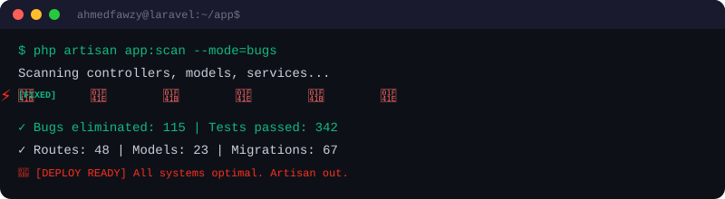

<div align="center">
  
</div>

<div align="center">
  <a href="mailto:01ahmedfawzy23@gmail.com"></a>
  <a href="https://linkedin.com/in/ahmedfawzy23"></a>
  <a href="https://github.com/ahmedfawzy23"></a>
  
</div>

<br/>

<div align="center">
  
</div>

<br/>


## 🐍 &nbsp;Contribution Snake

<div align="center">
  <picture>
    <source media="(prefers-color-scheme: dark)" srcset="https://raw.githubusercontent.com/ahmedfawzy23/ahmedfawzy23/output/github-snake-dark.svg" />
    <source media="(prefers-color-scheme: light)" srcset="https://raw.githubusercontent.com/ahmedfawzy23/ahmedfawzy23/output/github-snake.svg" />
    
  </picture>
</div>

<br/>


## 🛡️ &nbsp;Bug Scanner Terminal

<div align="center">
  
</div>

<br/>


##  &nbsp;About Me

<table>
<tr>
<td width="55%">

```php
<?php

namespace App\Developers;

class AhmedFawzy extends SeniorDeveloper
{
    protected string $role = 'Senior Backend Architect';
    protected string $company = 'Digital Bond Arch';
    protected string $experience = '3+ years';

    public function skills(): array
    {
        return [
            'backend'   => ['PHP', 'Laravel', 'REST APIs'],
            'databases' => ['MySQL', 'Redis', 'Eloquent ORM'],
            'devops'    => ['Docker', 'Linux', 'CI/CD'],
            'frontend'  => ['Blade', 'Livewire', 'Tailwind'],
            'tools'     => ['Git', 'Postman', 'Composer'],
        ];
    }

    public function mentor(): string
    {
        return '500+ trainees mentored successfully';
    }

    public function motto(): string
    {
        return 'Code like an artisan, 
                architect like a visionary.';
    }
}
```

</td>
<td width="45%" align="center">


</td>
</tr>
</table>


## 🧑‍💼 &nbsp;Experience Timeline

<div align="center">
<table>
<tr>
<td align="center" width="50%">

<br/><br/>
<br/>
<sub><b>Sep 2025 – Present</b></sub><br/><br/>
<sub>✅ Optimized 10+ enterprise systems</sub><br/>
<sub>✅ Reduced response time by 30%</sub><br/>
<sub>✅ Architected microservice solutions</sub><br/>
<sub>✅ Laravel + Docker production pipelines</sub>

</td>
<td align="center" width="50%">

<br/><br/>
<br/>
<sub><b>Feb 2023 – Present</b></sub><br/><br/>
<sub>✅ Led team of 20+ mentors</sub><br/>
<sub>✅ Mentored 500+ successful trainees</sub><br/>
<sub>✅ Developed Laravel training curriculum</sub><br/>
<sub>✅ Code review & best practices coaching</sub>

</td>
</tr>
</table>
</div>


## 🧰 &nbsp;Tech Arsenal

<div align="center">

### ⚙️ Core — PHP & Laravel Ecosystem


### 🌐 Frontend & Templating


### 🛠️ DevOps & Tools


### 📚 Also Experienced In


</div>


## 🏗️ &nbsp;Laravel Projects

<div align="center">
<table>
<tr>
<td align="center" width="50%">
<br/><br/>
<sub><b>Nationwide Healthcare Audits</b></sub><br/>
<sub>Large-scale survey platform for healthcare</sub><br/>
<sub>compliance auditing across the nation</sub><br/><br/>


</td>
<td align="center" width="50%">
<br/><br/>
<sub><b>Open Source Laravel Package</b></sub><br/>
<sub>Flexible role & permission management</sub><br/>
<sub>system for any Laravel application</sub><br/><br/>


</td>
</tr>
<tr>
<td align="center" width="50%">
<br/><br/>
<sub><b>Loyalty & Delivery Systems</b></sub><br/>
<sub>Complete ordering system with loyalty</sub><br/>
<sub>rewards and real-time delivery tracking</sub><br/><br/>


</td>
<td align="center" width="50%">
<br/><br/>
<sub><b>Global Trade Platform</b></sub><br/>
<sub>International trade platform connecting</sub><br/>
<sub>businesses across borders</sub><br/><br/>


</td>
</tr>
</table>
</div>


## 📊 &nbsp;GitHub Analytics

<div align="center">
  
  
</div>

<br/>

<div align="center">
  
</div>

<br/>

<div align="center">
  
</div>

<br/>

<div align="center">
  
</div>


## 🧊 &nbsp;3D Contribution Map

<div align="center">
  
</div>

<br/>


<div align="center">

```
php artisan inspire
// "Simplicity is the ultimate sophistication." — Leonardo da Vinci
```

</div>

<div align="center">
  
</div>
