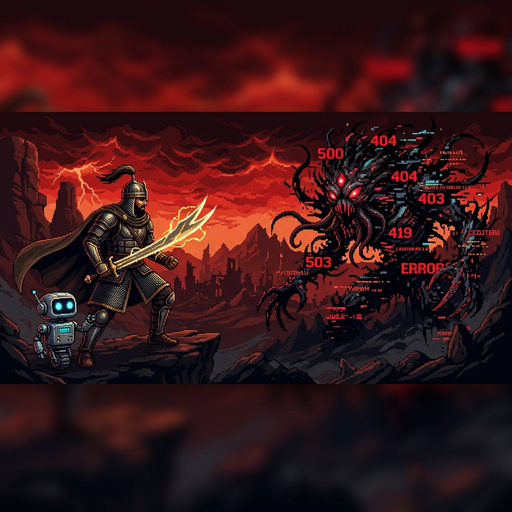
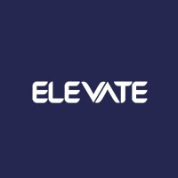

<div align="center">
  
</div>

<br/>

<div align="center">
  
  <br/>
  <sub><i>Every bug is a boss fight — and I ship the fix.</i></sub>
</div>

<br/>

<table width="100%" border="0">
<tr>
<td width="58%" valign="top">

<h3>Welcome to my GitHub workspace</h3>

<p>
Backend Engineer at <strong>Digital Bond</strong> — I architect high-traffic Laravel APIs,
own engineering standards end-to-end, and mentor the next generation of PHP developers.
</p>

<table>
  <tr>
    <td><b>Email</b></td>
    <td><a href="mailto:01ahmedfawzy23@gmail.com">01ahmedfawzy23@gmail.com</a></td>
  </tr>
  <tr>
    <td><b>LinkedIn</b></td>
    <td><a href="https://linkedin.com/in/ahmedfawzy23">linkedin.com/in/ahmedfawzy23</a></td>
  </tr>
  <tr>
    <td><b>WhatsApp</b></td>
    <td><a href="https://wa.me/201274106118">+20 127 410 6118</a></td>
  </tr>
  <tr>
    <td><b>Location</b></td>
    <td>Giza, Egypt — Open to Remote & Hybrid</td>
  </tr>
  <tr>
    <td><b>Resume</b></td>
    <td><a href="https://bit.ly/Ahmed_Fawzy_PHP_Laravel_Developer"><strong>Download PDF CV</strong></a></td>
  </tr>
</table>

<br/>

> **Available** — Actively seeking Backend / Laravel roles (Egypt or Remote)

</td>
<td width="42%" align="center" valign="middle">

<a href="https://bit.ly/Ahmed_Fawzy_PHP_Laravel_Developer" target="_blank">
  
</a>

<br/>

<sub><b>Scan or <a href="https://bit.ly/Ahmed_Fawzy_PHP_Laravel_Developer">click here</a> for CV</b></sub>

<br/><br/>


</td>
</tr>
</table>

<br/>


<br/>

## About Me

<table width="100%">
<tr>
<td width="54%" valign="top">

```php
<?php

namespace App\Developers;

class AhmedFawzy extends BackendDeveloper
{
    protected string $role       = 'Backend Engineer';
    protected string $location   = 'Giza, Egypt';
    protected string $experience = '2+ years';
    protected string $education  = 'Medical Informatics';
    protected bool   $available  = true;

    public function skills(): array
    {
        return [
            'backend'   => ['PHP', 'Laravel', 'REST APIs'],
            'databases' => ['MySQL', 'MongoDB', 'Redis'],
            'devops'    => ['Docker', 'Git', 'Linux', 'CI/CD'],
            'frontend'  => ['Blade', 'JS', 'Bootstrap'],
        ];
    }

    public function wins(): array
    {
        return [
            '-30% response time'   => 'Redis caching @ WHOIPC',
            '-25% regression bugs' => 'PR reviews @ Digital Bond',
            '500+ devs trained'    => 'Route Academy cohorts',
            '10+ shipped systems'  => 'Production-grade APIs',
        ];
    }
}
```

</td>
<td width="46%" align="center" valign="middle">


</td>
</tr>
</table>

<br/>

## Tech Stack

<div align="center">

<br/><br/>


</div>

<br/>


<br/>

## Professional Experience

<table width="100%">
  <tr>
    <td width="13%" align="center" valign="top"><br/>
      
    </td>
    <td width="87%" valign="top">
      <h3>Back-End Engineer — Digital Bond</h3>
      <p><sub><b>Sep 2025 – Present | Dokki, Giza — Full-time</b></sub></p>
      <ul>
        <li>Architected <b>10+ production RESTful APIs</b> in Laravel; cut avg response time <b>30%</b> on WHOIPC via Redis caching & query optimization.</li>
        <li>Established coding standards & PR review processes across the full engineering team → <b>25% fewer regression bugs</b>.</li>
        <li>Delivered enterprise healthcare & management portals with seamless front-end integration.</li>
      </ul>
    </td>
  </tr>
  <tr>
    <td width="13%" align="center" valign="top"><br/>
      
    </td>
    <td width="87%" valign="top">
      <h3>PHP/Laravel Lead Mentor — Route Academy</h3>
      <p><sub><b>Feb 2023 – Present | Dokki, Giza — Part-time</b></sub></p>
      <ul>
        <li>Mentored <b>500+ trainees</b> across cohorts — student satisfaction consistently above <b>90%</b>.</li>
        <li>Led team of 3+ mentors: curriculum planning, session quality reviews, mentor onboarding.</li>
        <li>Supervised graduation projects with architectural feedback & code review standards.</li>
      </ul>
    </td>
  </tr>
  <tr>
    <td width="13%" align="center" valign="top"><br/>
      
    </td>
    <td width="87%" valign="top">
      <h3>Back-End Developer — Elevate Tech</h3>
      <p><sub><b>Jan 2025 – Jan 2026 | Remote — Freelance</b></sub></p>
      <ul>
        <li>Delivered high-performance back-end solutions for <b>3+ clients</b> using Laravel.</li>
        <li>Built secure payment gateway integrations and optimized relational databases.</li>
      </ul>
    </td>
  </tr>
</table>

<br/>


<br/>

## Featured Projects

<table width="100%">
  <tr>
    <td width="50%" valign="top">
      <h3 align="center">WHO IPC Monitoring & Evaluation</h3>
      <p align="center"><sub><b>Nationwide Healthcare Audit Platform</b></sub></p>
      <ul>
        <li>Built for the <b>World Health Organization (Egypt)</b> — digitizing facility assessments nationwide.</li>
        <li>Survey engines with conditional logic & auto-scoring.</li>
        <li>Hierarchical RBAC: National → Regional → Facility.</li>
        <li>Firebase Cloud Messaging for real-time risk alerts.</li>
      </ul>
      <p align="center">
        <code>Laravel</code> · <code>MySQL</code> · <code>Firebase FCM</code> · <code>Redis</code>
      </p>
    </td>
    <td width="50%" valign="top">
      <h3 align="center">laravel-roles-permissions</h3>
      <p align="center"><sub><b>Open-Source Package on Packagist</b></sub></p>
      <ul>
        <li>Lightweight, powerful RBAC authorization package for Laravel.</li>
        <li>Database-cached permission checks for high-speed resolution.</li>
        <li>Blade directives, middleware, and full API support.</li>
        <li>Published & maintained on <b>Packagist</b>.</li>
      </ul>
      <p align="center">
        <a href="https://packagist.org/packages/fawzy/laravel-roles-permissions"><b>Packagist</b></a> ·
        <a href="https://github.com/ahmedfawzy23/laravel-roles-permissions"><b>GitHub</b></a>
      </p>
    </td>
  </tr>
</table>

<details>
<summary><b>View More Production Projects</b></summary>
<br/>

<table width="100%">
  <tr>
    <td width="50%" valign="top">
      <h4>Meditrade Portal</h4>
      <p><sub><b>Import/Export Trading Platform</b></sub></p>
      <ul>
        <li>Full backend & schema for inventory trading.</li>
        <li>Bilingual CMS (Arabic & English).</li>
      </ul>
      <p><code>Laravel</code> · <code>MySQL</code> · <code>REST APIs</code></p>
    </td>
    <td width="50%" valign="top">
      <h4>EGEC Student Management</h4>
      <p><sub><b>EdTech Enrollment Engine</b></sub></p>
      <ul>
        <li>Bilingual engine connecting students to Egyptian universities.</li>
        <li>Full registration-to-graduation flow.</li>
      </ul>
      <a href="https://arabsstudents.com"><code>arabsstudents.com</code></a>
    </td>
  </tr>
  <tr>
    <td width="50%" valign="top">
      <h4>Edugate UAE Admission</h4>
      <p><sub><b>Admissions Panel & Workflows</b></sub></p>
      <ul>
        <li>Automated email alerts, dynamic CMS, and program search.</li>
      </ul>
      <a href="https://ksa-students.com"><code>ksa-students.com</code></a>
    </td>
    <td width="50%" valign="top">
      <h4>Zi Sushi App Backend</h4>
      <p><sub><b>Food Ordering APIs</b></sub></p>
      <ul>
        <li>Loyalty programs, coupons, orders & localized delivery tracking.</li>
      </ul>
      <p><code>Laravel</code> · <code>MySQL</code> · <code>REST APIs</code></p>
    </td>
  </tr>
  <tr>
    <td colspan="2" align="center">
      <h4>Pulmonary Disease Detection — Graduation Project</h4>
      <p><sub><b>AI-Powered Early Detection System</b></sub></p>
      <ul>
        <li>Respiratory sound signal processing for health diagnostics.</li>
        <li>Laravel backend + Python AI/ML classification models.</li>
      </ul>
      <p><code>Laravel</code> · <code>Python</code> · <code>AI/ML</code> · <code>MySQL</code></p>
    </td>
  </tr>
</table>

</details>

<br/>


<br/>

## GitHub Analytics

<table width="100%">
  <tr>
    <td width="50%" align="center">
      
    </td>
    <td width="50%" align="center">
      
    </td>
  </tr>
</table>

<br/>

<div align="center">
  
</div>

<br/>

## Contribution Snake

<div align="center">
  <picture>
    <source media="(prefers-color-scheme: dark)" srcset="https://raw.githubusercontent.com/ahmedfawzy23/ahmedfawzy23/output/github-snake-dark.svg" />
    <source media="(prefers-color-scheme: light)" srcset="https://raw.githubusercontent.com/ahmedfawzy23/ahmedfawzy23/output/github-snake.svg" />
    
  </picture>
</div>

<br/>


